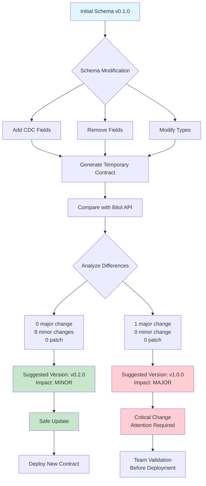

```mermaid
flowchart TD
    A[Initial Schema v0.1.0] --> B{Schema Modification}
    B --> C[Add CDC Fields]
    B --> D[Remove Fields]
    B --> E[Modify Types]
    
    C --> F[Generate Temporary Contract]
    D --> F
    E --> F
    
    F --> G[Compare with Bitol API]
    G --> H{Analyze Differences}
    
    H --> I[0 major change<br/>8 minor changes<br/>0 patch]
    H --> J[1 major change<br/>0 minor change<br/>0 patch]
    
    I --> K[Suggested Version: v0.2.0<br/>Impact: MINOR]
    J --> L[Suggested Version: v1.0.0<br/>Impact: MAJOR]
    
    K --> M[Safe Update]
    L --> N[Critical Change<br/>Attention Required]
    
    M --> O[Deploy New Contract]
    N --> P[Team Validation<br/>Before Deployment]
    
    style A fill:#e1f5fe
    style K fill:#c8e6c9
    style L fill:#ffcdd2
    style M fill:#c8e6c9
    style N fill:#ffcdd2
```
