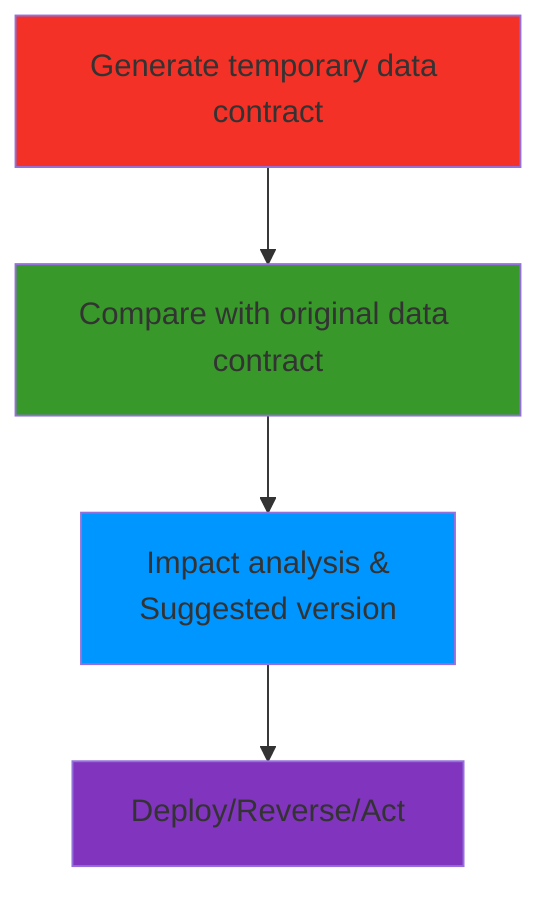
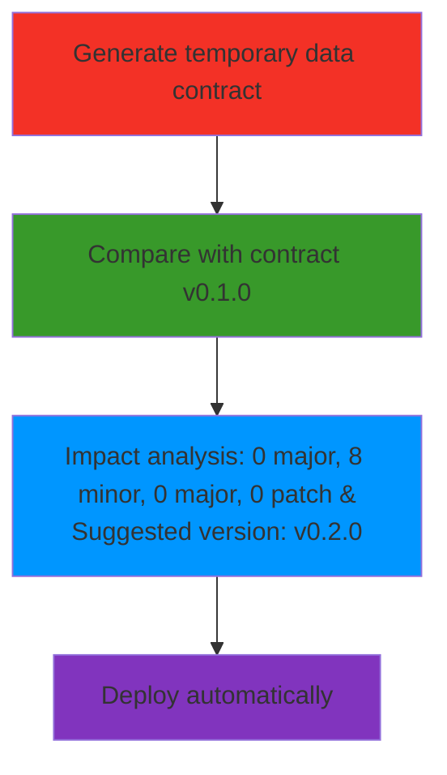
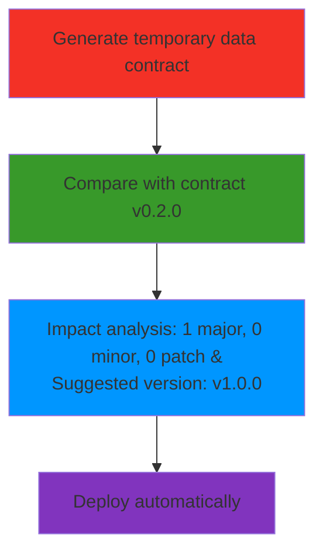

# Generic process

# Minor change: Adding a field

# Minor change: Deleting a field

# Sponsor
If you like this project, I would be super grateful if you could help me finance it through [my Buy me a Coffee page](https://buymeacoffee.com/jgperrin) (although I mostly drink tea...)
